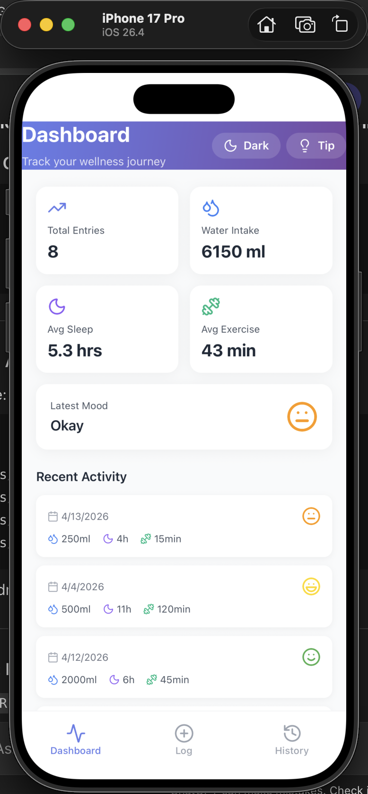
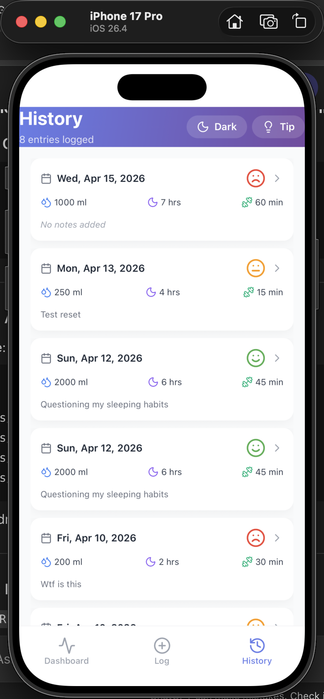
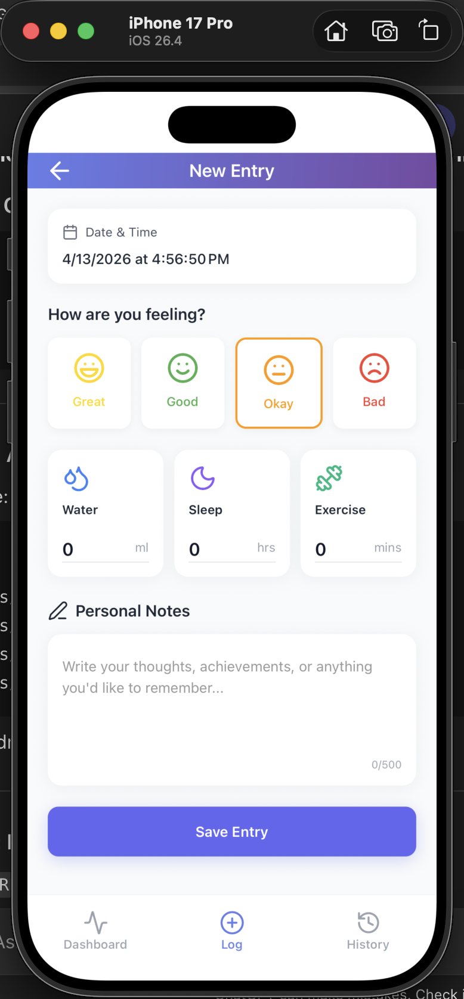

# Wellness Tracker (Expo + TypeScript)

A multi-screen wellness tracker built with **Expo**, **React Navigation**, **Zustand** (local app state), **AsyncStorage** (persistence), and a **GraphQL** “Health Tips” API (mock Apollo Server) consumed via **TanStack React Query** with caching + pagination.

## 📸 Screenshots

<p align="center">
  
  
  
</p>

<p align="center">
  
</p>

## Features

- **Navigation**
  - Bottom tabs: **Dashboard**, **Log Entry**, **History**
  - Nested stack drill-down: tap an entry → **Entry Detail**
  - Modal pattern: **Tip of the Day** (presented as a modal)
  - **Typed navigation**: route names + params are typed via `RootStackParamList` / `TabParamList`
  - **Deep linking**: `wellness://entry/:entryId` opens a specific entry
  - **Theme toggle**: in-app dark mode toggle (overrides system)

- **Full CRUD + Persistence**
  - Create health entries with fields: **date/time**, **mood**, **water**, **sleep**, **exercise**, **notes**
  - Form validation (required mood/date + sensible ranges) with **React Hook Form + Yup**
  - Update entries with pre-populated form
  - Delete entries with confirmation
  - Entries persist across app restarts via **AsyncStorage**

- **External API (GraphQL)**
  - Health tips served from a local **Apollo GraphQL** server (`server/`)
  - React Query infinite query with page-based GraphQL pagination
  - **Caching** via `staleTime`
  - Loading + error states with retry
  - Pull-to-refresh on list-based screens
  - Swipe-to-delete on History entries (with confirmation)

## Tech Stack

- **App**: Expo SDK 54, React Native 0.81, TypeScript (strict)
- **Navigation**: `@react-navigation/bottom-tabs` + `@react-navigation/native-stack`
- **State**
  - Global app state: Zustand (`src/store/entryStore.ts`)
  - Server/API state: TanStack React Query (`App.tsx`, `src/hooks/*`)
  - Form state: React Hook Form + Yup (`src/screens/entry/EntryScreen.tsx`)
- **Persistence**: AsyncStorage (`src/services/storage/entryStorage.ts`)
- **UI**: NativeWind + Tailwind, Lucide icons
- **API**: Apollo Server GraphQL mock (`server/server.js`)

## Getting Started (Local)

### Prerequisites

- **Node.js**: recommended 18+ (works with Node 20+)
- **Xcode** installed (for iOS simulator)
- **Expo CLI** (optional): you can use `npx` only

### 1) Install dependencies

From the repo root:

```bash
npm install
```

### 2) Start the GraphQL API (Health Tips)

In a second terminal:

```bash
cd server
npm install
npm run dev
```

The server listens at `http://localhost:4000/graphql`.

### 3) Start the Expo app

Back at the repo root:

```bash
npx expo start
```

### 4) Run on iOS Simulator

With the Expo dev server running:

```bash
npx expo start --ios
```

Or press `i` in the Expo CLI terminal.

## Environment Variables

By default, the app uses `http://localhost:4000/graphql`.

To override, set:

- **`EXPO_PUBLIC_GRAPHQL_URL`**: GraphQL endpoint URL

Example (macOS / zsh):

```bash
export EXPO_PUBLIC_GRAPHQL_URL="http://localhost:4000/graphql"
```

## Deep Linking

The app configures linking in `App.tsx` and sets the Expo scheme in `app.json`.

- **Entry detail**: `wellness://entry/123`
- **Tip modal**: `wellness://tip`

Test on iOS simulator:

```bash
npx uri-scheme open "wellness://entry/123" --ios
```

## Project Structure (high-level)

- `App.tsx`: providers (React Query) + navigation container + linking
- `src/navigation/`: bottom tabs + root stack
- `src/screens/`: Dashboard, Entry (create/edit), Entry Detail, History, Tip modal
- `src/store/`: Zustand store for entries
- `src/services/`: AsyncStorage persistence + GraphQL API client
- `server/`: Apollo GraphQL server (mock health tips + pagination)

## Core Requirements Checklist

- **Multi-screen navigation**
  - Tabs (3): Dashboard / Entry / History
  - Stack drill-down: EntryDetail
  - Modal: TipModal
  - Typed navigation params: `src/types/navigation.ts`
  - Deep link configured: `wellness://entry/:entryId`

- **CRUD + local persistence**
  - Create / Read / Update / Delete entries
  - Date/time picker included
  - Validation included (Yup)
  - AsyncStorage persistence across restarts

- **External API integration**
  - GraphQL endpoint (local Apollo Server)
  - React Query caching + pagination + loading/error + retry

- **State management**
  - Zustand: app data
  - React Query: server data
  - React Hook Form: form state
  - Local `useState`: UI-only toggles/modals

- **TypeScript**
  - Strict mode enabled in `tsconfig.json`

  ## 🧠 Architecture Decisions

- **Zustand for global state**
  Chosen for its simplicity and minimal boilerplate compared to Redux. It provides a clean API for managing local app state (entries) without unnecessary complexity.

- **React Query for server state**
  Used to handle asynchronous GraphQL data (health tips), including caching, pagination, and loading/error states. This avoids manual state handling and improves performance.

- **React Hook Form + Yup**
  Provides efficient form state management with minimal re-renders, combined with schema-based validation for better maintainability.

- **NativeWind (Tailwind)**
  Enables rapid UI development with consistent styling and built-in dark mode support, improving development speed and maintainability.

- **Separation of concerns**
  - `store/` → app state
  - `services/` → API + persistence
  - `screens/` → UI logic

## ⚖️ Trade-offs & Limitations

- The GraphQL API is a local mock server instead of a real backend
- Data is stored locally via AsyncStorage (no cloud sync or multi-device support)
- No authentication or user accounts implemented
- UI animations and micro-interactions are minimal due to time constraints

## 🤔 Assumptions

- The app is intended for single-user usage
- Persistent storage is local-only
- Health tips API is simulated and does not require authentication
- The focus is on functionality and architecture rather than production-level UI polish

## 🛠 Future Improvements

- Add user authentication and cloud sync
- Replace mock GraphQL API with a real backend service
- Improve UI/UX with animations and transitions
- Add charts/visualizations for health trends
- Offline-first enhancements and sync strategies

## Notes

- `server/.env` is intentionally ignored from git. If you need it, create your own locally.
